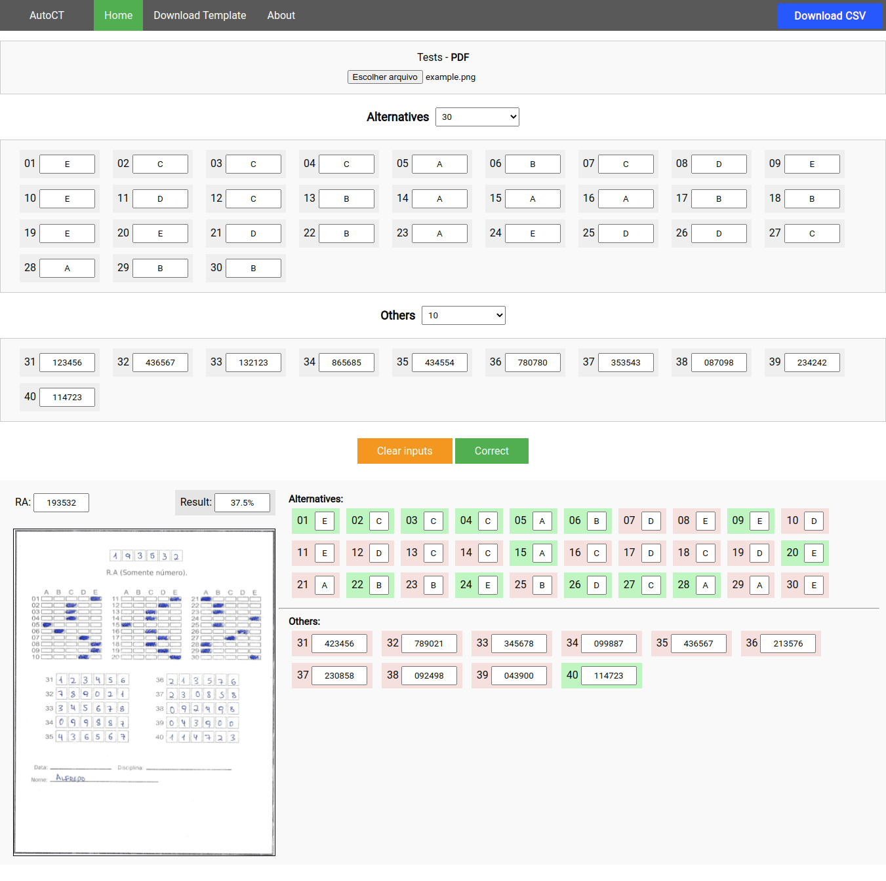

### AutoCT - Automação de Correção de Gabaritos

API hospedada no AWS lambda + API Gateway 
Function e Layer utilizadas em: [AWS-Lambda Backup](https://github.com/AlfredoFilho/AutoCT/tree/master/AWS-Lambda%20Backup) 
Repositório com códidos feitos para criar o modelo de reconhecimento de números: [AutoCT-Backend](https://github.com/AlfredoFilho/AutoCT-Backend)
 

Para testar, acesse o [Website](https://alfredofilho.github.io/AutoCT/) e faça download do [exemplo](https://raw.githubusercontent.com/AlfredoFilho/AutoCT/master/example.png). 
Selecione o arquivo no topo e preencha os campos com as respostas corretas do gabarito, em seguida, aperte em Correct.

Exemplo de funcionamento:

|    |
| --- |
